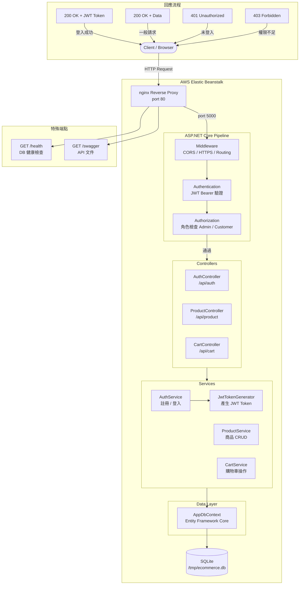

# EShop 系統流程圖



## 說明

| 層次 | 元件 | 職責 |
|------|------|------|
| 入口 | nginx | EB 自動配置，轉發到 port 5000 |
| Middleware | JWT Auth | 驗證 Token，附加使用者身份 |
| Controller | Auth / Product / Cart | 接收請求、驗證輸入、回傳結果 |
| Service | AuthService 等 | 商業邏輯，不直接接觸 HTTP |
| Data | AppDbContext | EF Core 操作 SQLite |

## 認證流程

1. 登入 → `AuthService` 驗證密碼 → `JwtTokenGenerator` 產生 Token
2. 後續請求帶上 `Authorization: Bearer <token>`
3. Middleware 驗證 Token → 取出角色（Admin / Customer）
4. `[Authorize(Roles = "Admin")]` 決定能否存取
```
